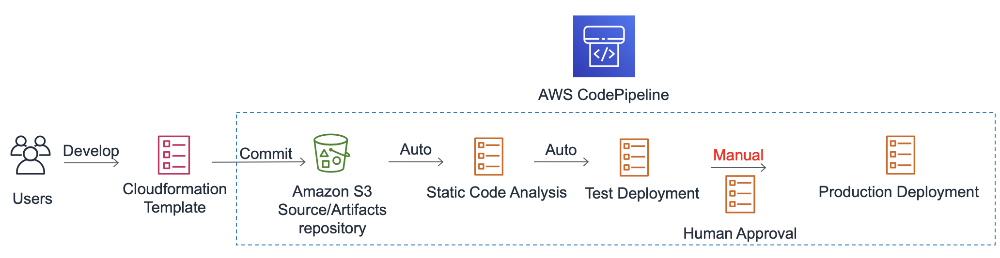

Bem vindo ao Workshop de DevSecOps.

Nesse workshop, vamos realizar algumas atividades de devsecops, usar algumas ferramentas e deixar o seu ambiente mais seguro!

#### Se você estiver fazendo este workshop em um evento, você receberá uma conta da AWS ou uma chave de hash para o workshop, você pode pular esse itens abaixo e ir direto para a parte que todos devem realizar. 

##### Se você estiver usando sua própria conta da AWS, siga estas etapas: 

* Faça o download ou clone esse repositório: https://github.com/aws-samples/secure-pipelines-in-aws-workshop
* Faça login com uma conta de nível Adminstrator;
* Crie um bucket s3 na região US-West-2 Oregon;
* Faça o upload dos dois arquivos zip para esse bucket;
* Vá para o Cloudformation e execute “pipeline.yml”;
* Altere o local do bucket para aquele que você criou anteriormente. Este local do bucket é para fazer referência aos arquivos zip;
* Implante a stack do Cloudformation;

A partir dos itens abaixo, **todos** devem realizar:
* Navegue até o console do CodePipeline. Você encontrará um novo Pipeline chamado DevSecOps;
* Desative a transição entre “StaticCodeAnalysis” e “TestDeployment”;
* Baixe o código para o workshop aqui: https://github.com/aws-samples/secure-pipelines-in-aws-workshop/tree/master/code
* No Console da AWS, acesse buckets do S3. Procure um bucket: “{cloudFormationStackName} -artifactstorebucket- {randomstring}
* Copie os dois arquivos zip para o bucket do S3 (lembre-se de copiar os arquivos zip, não os diretórios descompactados)
* Seu ambiente agora é criado com um pipeline usando s3 como repositório de origem.

{}
Siga em frente!

{}
