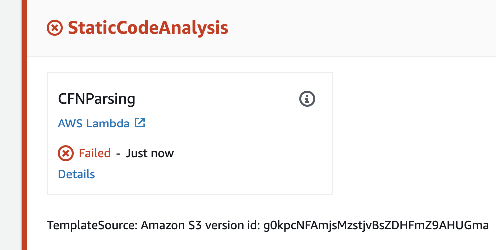
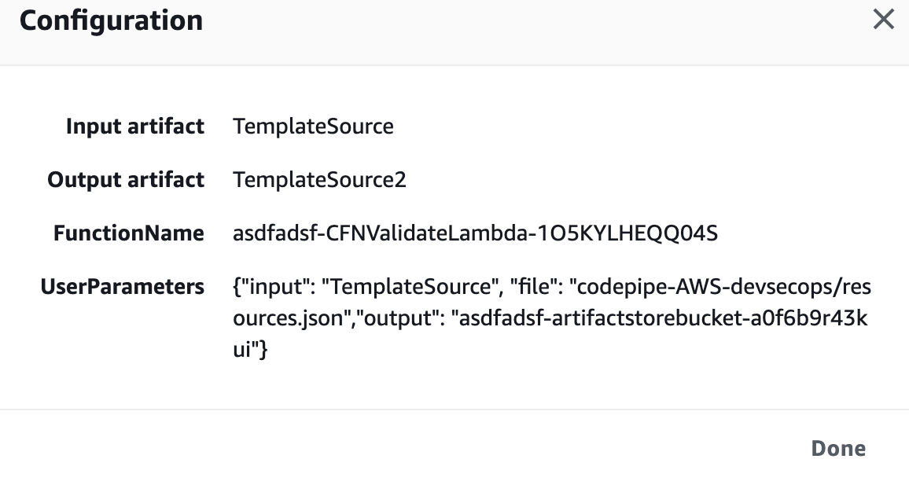
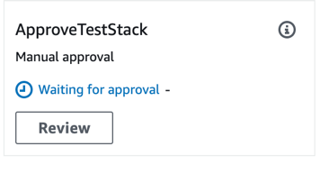

## Introdução
Como desenvolvedor, você fez upload dos arquivos zip para s3, você comprometeu o código no pipeline. Neste módulo, este exemplo mostra o que um desenvolvedor experimentaria quando o código não está em conformidade com os requisitos de segurança. Neste caso específico, há um requisito de segurança que os volumes do EBS devem ser criptografados.

Para descobrir o primeiro erro de pipeline, clique em “Release Change”.

Parece que o pipeline falhou no estágio “Análise de código estático”.

Clique no link “Detalhes” e dê uma olhada no erro. Com base na mensagem de erro, o que precisa ser alterado?
Clique no “i” ao lado de CFNParsing.

* Observe o local e o arquivo que isso está fazendo referência.
* Localize o arquivo, resources.json e abra-o com seu editor favorito. (Certos editores, como o bloco de notas do Windows ou Mac TextEditor, podem não funcionar ao editar arquivos json)
* Encontre o problema no arquivo e altere o valor.
* Recompacte o diretório com o resources.json modificado. O nome do arquivo zip é importante e deve corresponder ao nome original. O pipeline está procurando esse nome de arquivo especificamente. Se o Lambda levar um tempo para ser executado, veja os logs.
* Fazer upload e substituir o arquivo zip existente em: “{CloudFormationStackName} -artifactstorebucket- {randomstring}
* Volte para a tela do CodePipeline e veja os estágios passam pelo processamento novamente. Se você corrigiu o código corretamente, ele deve passar para o próximo estágio.
* Reative a transição que você desativou anteriormente.
* Quando chegar ao estágio ApproveTestStack, clique no botão Revisão e, em seguida, aprove a implantação. (Normalmente você receberá um e-mail pedindo aprovação manual, mas para os fins deste laboratório, não espere). Tudo deve continuar até que você tenha um gasoduto cheio de etapas que tiveram sucesso.

{}
Sinta-se livre para clicar em alguns ícones de detalhes para examinar o que aconteceu em cada estágio com mais detalhes. CFNParsing é uma função lambda é um script que faz várias verificações para conformidade de segurança.
{}

