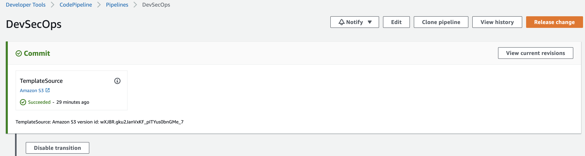
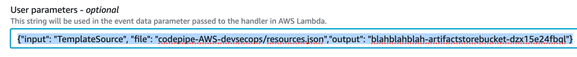

## Introdução

Neste módulo, como engenheiro de segurança, você adicionará uma função lambda que procurará as chaves do AWS Access e Secret.

### Configuração do Lambda para procurar credenciais da AWS
* Navegue até o console do Lambda e crie uma nova função a partir do zero.
* Certifique-se de selecionar o runtime do Python 2.7 e a função do módulo*Pipelinel- IAM.
* Nomeie a função à sua escolha e depois clique em Criar função.
* Defina o tempo do Lambda para 1 minuto.
* cfn_secrets.py é fornecido no workshop. Abra isso no seu editor favorito.
* Cole o conteúdo do editor de código-fonte cfn_secrets.py (aquele no console do Lambda), substituindo a função de espaço reservado inicial.
* Navegue de volta ao Console do CodePipeline e abra seu pipeline DevSecops novamente.
* Edite o pipeline usando o botão no canto superior direito 

* Use o botão Editar estágio para o estágio StaticCodeAnalysis.
* Selecione o ícone Editar para a função CFNParsing.
* Copie o conteúdo de “Parâmetros do usuário (opcional)” para o buffer de pasta. Feche o pop-up E

* Adicione um novo grupo de ações.
* Selecione “Adicionar grupo de ações”.
* Crie um nome para sua ação de varredura de chaves, escolha o AWS Lambda no menu suspenso(dropdownß) Provedor de ações.
* Em “Nome da função”, selecione o nome que você deu à sua função Lambda na Etapa 2 acima.
* TemplateSource no menu suspenso(dropdown) “Artefatos de entrada”.
* Cole o conteúdo do buffer de pasta de cima em “Parâmetros do usuário (opcional)”
* Selecione Salvar o pipeline recém-editado. Você deve marcar a opção “Nenhuma atualização de recursos necessária para esta alteração de ação de origem” na janela pop-up salvar pipeline.
* Sua nova função do Lambda agora está integrada ao seu pipeline.
* Prossiga para o próximo módulo para testar sua função do Lambda.