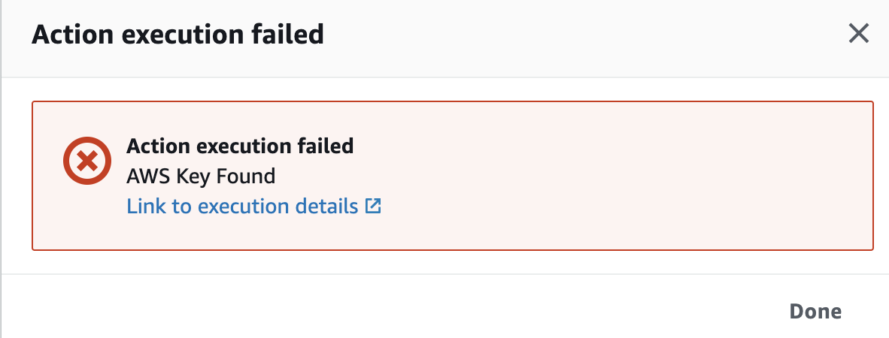

## Introdução

Infelizmente, nem todo o código que está em um repositório de origem estará livre de segredos, senhas e chaves. Neste módulo, como desenvolvedor, você verá o que a automação de segurança pode fazer para ajudar a manter informações confidenciais, como chaves da AWS, ficar fora dos repositórios de origem.

Liberar a alteração para iniciar a criação de código novamente no pipeline atualizado. Oops — o código tinha algumas credenciais da AWS nele — mas desta vez nós as pegamos e paramos a compilação!

Remova as credenciais.

* Edite resource.json e remova as credenciais ofensivas.
* Rezip o “codepipe-AWS-devsecops.zip” (o nome exato é importante)
* Carregue o zip para s3.
* Volte para o pipeline DevSecops e observe-o através dos estágios novamente.
  
{}
Você pode usar funções do IAM em vez disso?
{}